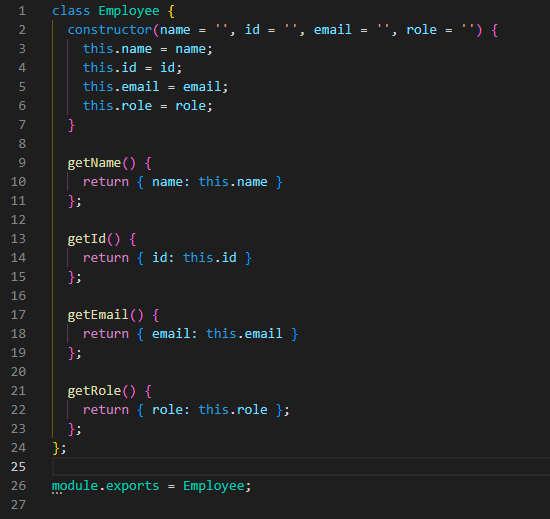

# Team Profile Generator 

## Description
Team Profile Generator easily creates an HTML file with your team's information! This simple template can be used to quickly create a profile of your team with a clean, finished look.

## Table of Contents
* [Installation](#installation)
* [Usage](#usage)
* [Contributing](#contributing)
* [Tests](#tests)
* [Questions](#questions)
* [Deployed Application](#deployed-application)

## Installation
To install Team Profile Generator, go to its GitHub repository and download the zip file to the desired location on your machine. Then, after extracting all of its contents, open the root directory of Team Profile Generator in your terminal and type "node index" into the command line to run it.

## Usage
After initializing the application, read the prompts and answer the questions accordingly. Note that the input you provide will be used in the generated file exactly as it is entered into the application (capitalization, spaces, etc.) so keep that in mind for formatting reasons when typing in proper nouns, phone numbers, and email addresses. When you are finished adding your team members simply select "Finish building team" from the prompt menu and you will see a confirmation message that your file was created, unless there was some kind of error, in which case you will see the error message. Your generated file will be in the /dist directory of the Team Profile Generator root directory that you downloaded from GitHub and extracted. You can open the file to edit it directly if desired or simply cut/copy/paste it where ever necessary for use from there.

## Contributing
This is an open source project and as such, please follow the [Contributor Covenant](https://www.contributor-covenant.org/).

## Tests
This application was created using Node.js via Test Driven Development and Object Oriented Programming. The following image shows the properties, methods, and tests for an "Employee" object class that was used to create each employee element (each employee category - Manager, Engineer, and Intern - was also made into a separate object that extended this "Employee" class).

Each class of objects was tested in this way before the rest of the application was coded. As shown below, each object passes all tests succcessfully, meaning that each object's properties and methods are defined and operate as expected.

## Questions
Check out my GitHub profile [here!](https://www.github.com/SpaghettiMedic) I can be reached directly at dsteiner247@gmail.com should you have any questions.

## Deployed Application
https://www.github.com/spaghettimedic/teamProfileGenerator